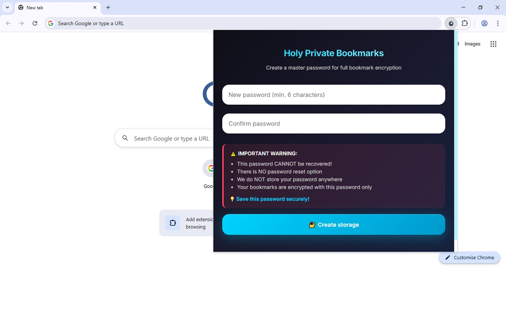
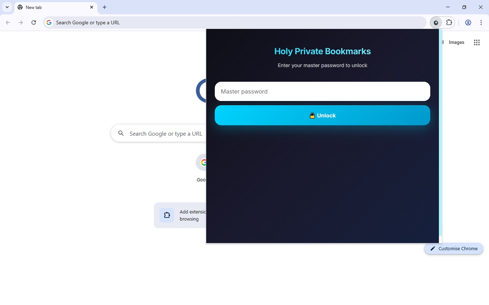
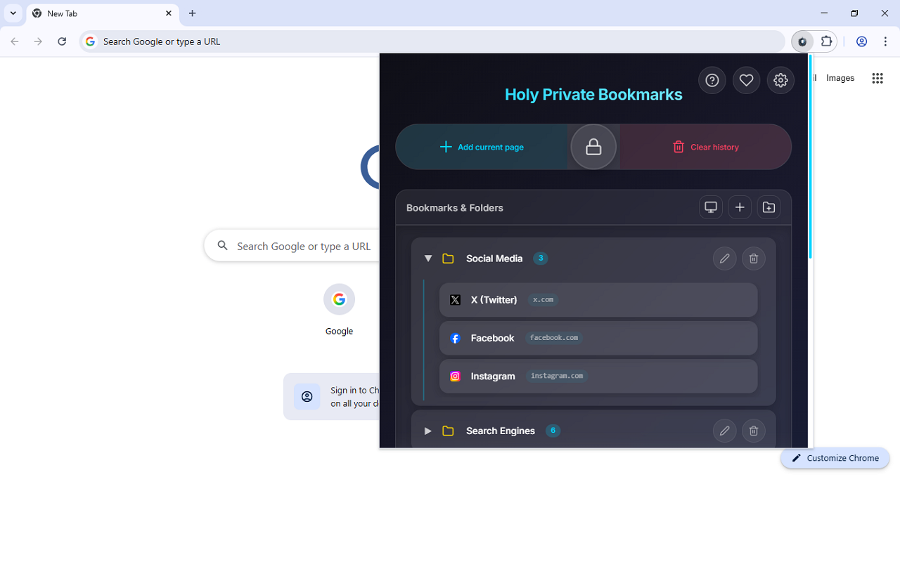
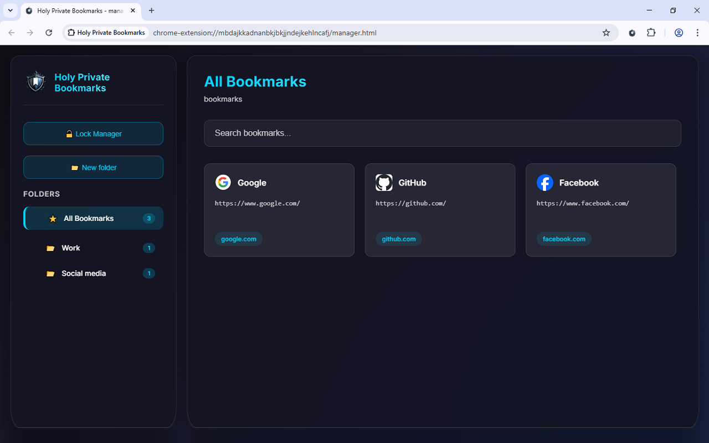
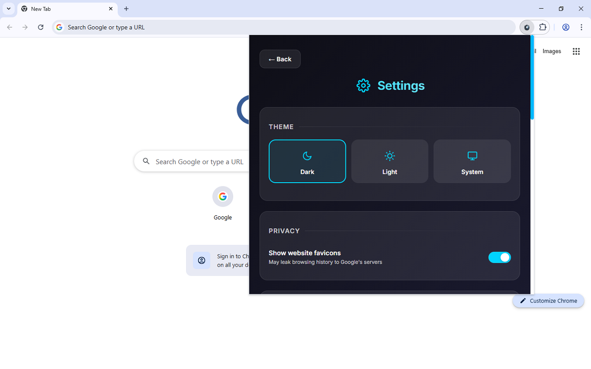
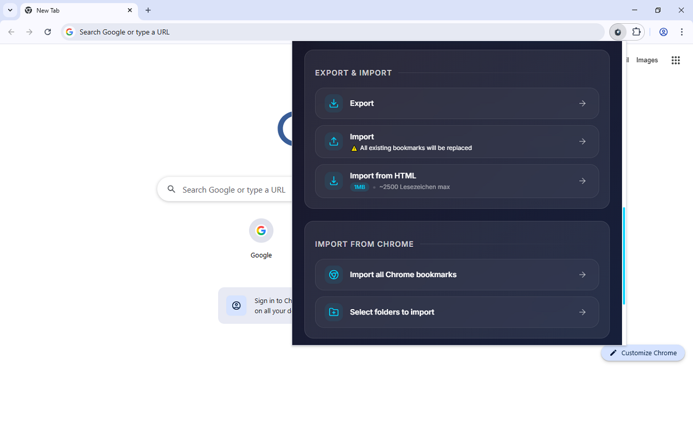

  

# Holy Private Bookmarks

**Fully encrypted private bookmarks right in your browser.**

A Chrome extension that stores your bookmarks locally in fully encrypted form.  
No one except you (not even us) can read them — everything is encrypted with a master password using AES-GCM.

## Features

- Full bookmark encryption (AES-GCM + PBKDF2)
- No servers — everything is stored locally
- Import from standard Chrome bookmarks
- Support for folders and nested structure
- Context menu for quick bookmark adding
- Auto-lock after 10 minutes of inactivity
- Clear browsing history for domains present in bookmarks

## Screenshots

## 🤖 AI Assistance

Parts of this project's code were developed with the assistance of AI tools (such as ChatGPT Grok). All generated code has been reviewed, tested, and adapted by human contributors to meet the project's quality and security standards.

## Installation

[Install from Chrome Web Store](https://chromewebstore.google.com/detail/holy-private-bookmarks/nnafnomgekidkehbgkfmhapccelgdbch)

Or load it manually:
1. Download a release or clone the repository
2. Open `chrome://extensions`
3. Enable "Developer mode"
4. Click "Load unpacked" and select the folder

## License

Copyright (C) 2026 OSV-IT-Studio

This program is free software: you can redistribute it and/or modify it under the terms of the **GNU General Public License** as published by the Free Software Foundation, either version 3 of the License, or (at your option) any later version.

This program is distributed in the hope that it will be useful, but WITHOUT ANY WARRANTY; without even the implied warranty of MERCHANTABILITY or FITNESS FOR A PARTICULAR PURPOSE. See the GNU General Public License for more details.

You should have received a copy of the GNU General Public License along with this program. If not, see <https://www.gnu.org/licenses/>.

The complete license text is available in the [LICENSE](LICENSE) file.

## Support the Project

If you find the extension useful, any support is greatly appreciated:

- Bitcoin (BTC): `bc1q9rz9uu9c48ydrmgrmu9kzqjp9mrdzavcll09uq`
- Ethereum (ETH): `0xAc862138b1ebF8d7F4fdb23D821489Cf91c314d0`

❤️ Thank you!
