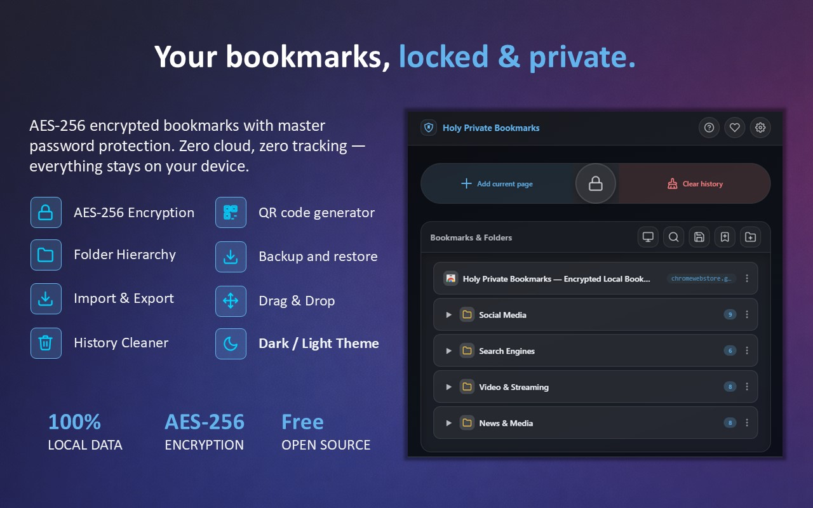
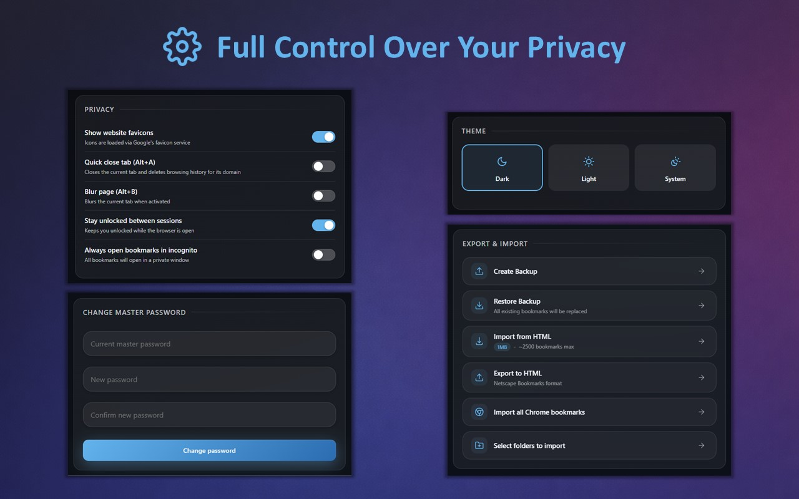
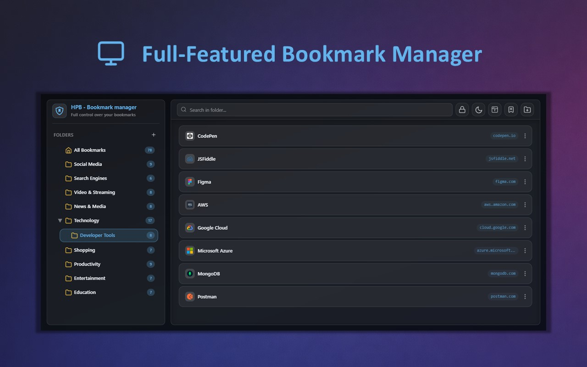

  

# Holy Private Bookmarks

**Fully encrypted private bookmarks right in your browser.**

A Chrome extension that stores your bookmarks locally in fully encrypted form.  
No one except you (not even us) can read them — everything is encrypted with a master password using AES-GCM.

---

## 🌐 Official Website

Visit our **[official website](https://osv-it-studio.github.io/holy-private-bookmarks/)** for:
- 📖 Detailed feature overview with screenshots
- ❓ Frequently Asked Questions
- 🎯 Interactive demonstration of all functions
- 🔧 Troubleshooting guides

---

## Features

- 🔒 Full bookmark encryption (AES-GCM + PBKDF2)
- ☁️ No servers — everything is stored locally on your device
- 📁 Folders and nested structure support
- 🖱️ Quick actions panel on every bookmark and folder (edit, copy URL, QR code, open in private tab, delete)
- 🔍 Search across all folders in the bookmark manager
- 📥 Import from Netscape HTML format
- 📥 Import directly from Chrome's built-in bookmarks
- 📤 Export to Netscape HTML format (compatible with Chrome, Firefox, Edge, etc.)
- 💾 Backup and restore — create encrypted backups and restore them on the setup screen
- 🗂️ Fullscreen Bookmark Manager for bulk operations — move, rename, delete, search
- 🖱️ Context menu integration for quick bookmark adding from any page
- ⌨️ Quick Close Tab — press Alt+A (or Command+Shift+A on Mac) to instantly close a tab and clear its domain history
- ⏰ Auto-lock after 10 minutes of inactivity
- 🌓 Dark/Light theme support

## Screenshots

> 📸 **More screenshots available on our [website](https://osv-it-studio.github.io/holy-private-bookmarks/)**

## 🤖 AI Assistance

Parts of this project's code were developed with the assistance of AI tools (such as ChatGPT Grok). All generated code has been reviewed, tested, and adapted by human contributors to meet the project's quality and security standards.

## Installation

Or load it manually:
1. Download a release or clone the repository
2. Open `chrome://extensions`
3. Enable "Developer mode"
4. Click "Load unpacked" and select the folder

## Open Source Libraries

This project uses the following open source libraries:

| Library | Author | License |
|---------|--------|---------|
| [QR Code Generator](https://github.com/kazuhikoarase/qrcode-generator) | © 2009 Kazuhiko Arase | MIT |

## License

Copyright (C) 2026 OSV-IT-Studio

This program is free software: you can redistribute it and/or modify it under the terms of the **GNU General Public License** as published by the Free Software Foundation, either version 3 of the License, or (at your option) any later version.

This program is distributed in the hope that it will be useful, but WITHOUT ANY WARRANTY; without even the implied warranty of MERCHANTABILITY or FITNESS FOR A PARTICULAR PURPOSE. See the GNU General Public License for more details.

You should have received a copy of the GNU General Public License along with this program. If not, see <https://www.gnu.org/licenses/>.

The complete license text is available in the [LICENSE](LICENSE) file.

## Support the Project

If you find the extension useful, any support is greatly appreciated:

- USDT (TRC20): `TFy6hrDvi2jiKJcQQ9zibkr41TmLVtKaSC`
- Bitcoin (BTC): `bc1q9rz9uu9c48ydrmgrmu9kzqjp9mrdzavcll09uq`
- Ethereum (ETH): `0xAc862138b1ebF8d7F4fdb23D821489Cf91c314d0`

❤️ Thank you!

---

  <a href="https://osv-it-studio.github.io/holy-private-bookmarks/">📚 Official Website</a> •
  <a href="https://github.com/OSV-IT-Studio/holy-private-bookmarks/issues">🐛 Report Bug</a> •
  <a href="https://github.com/OSV-IT-Studio/holy-private-bookmarks/discussions">💬 Discussions</a>

